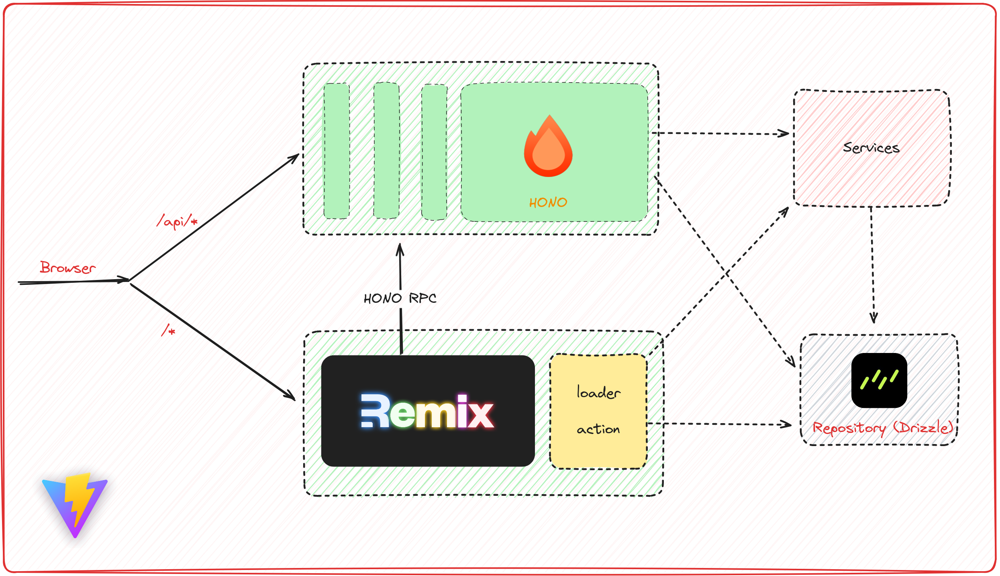

# Remix + Hono with Vite!

remix with hono backend with vite, this project handle from api, authentication, to db. built with
- [remix](https://remix.run/) as frontend framework
- [vite](https://vitejs.dev) as bundler and dev server
- [drizzle](https://orm.drizzle.team/) + postgresql
- [hono](https://hono.dev/) for api server